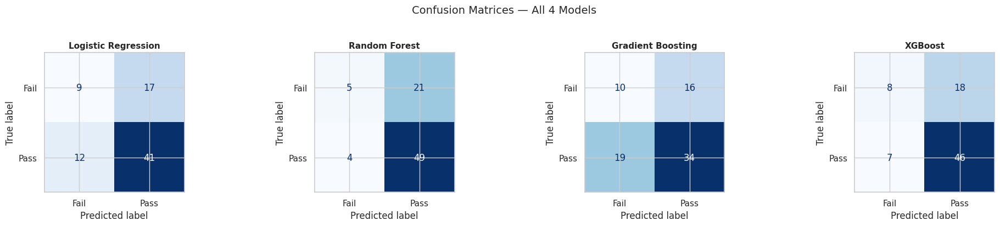
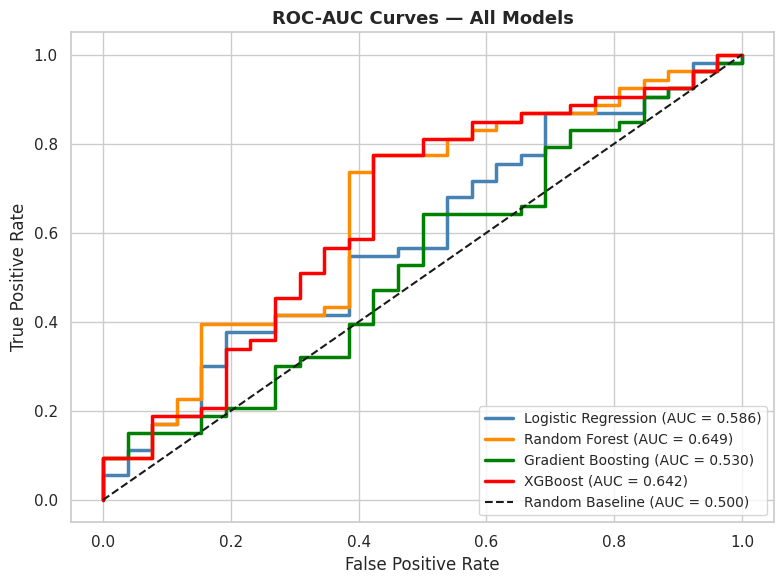
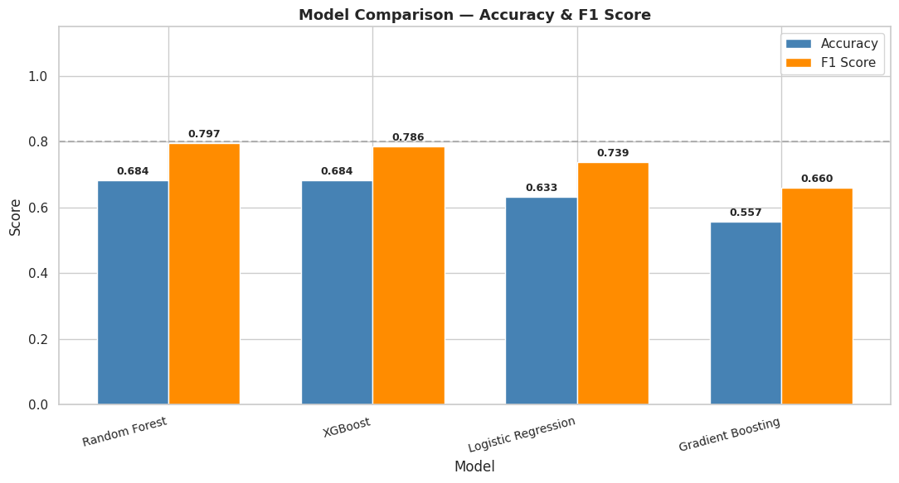
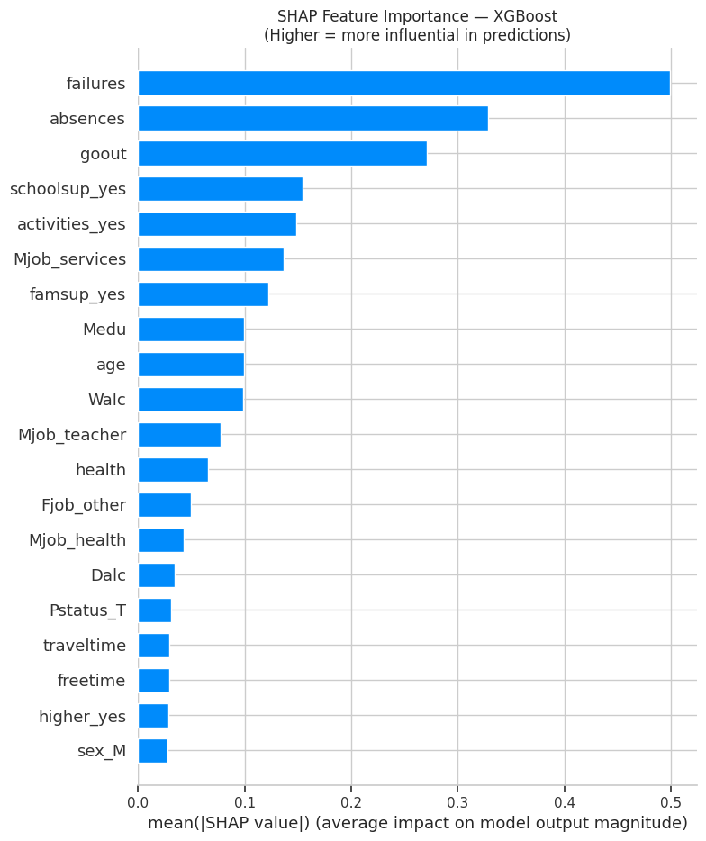
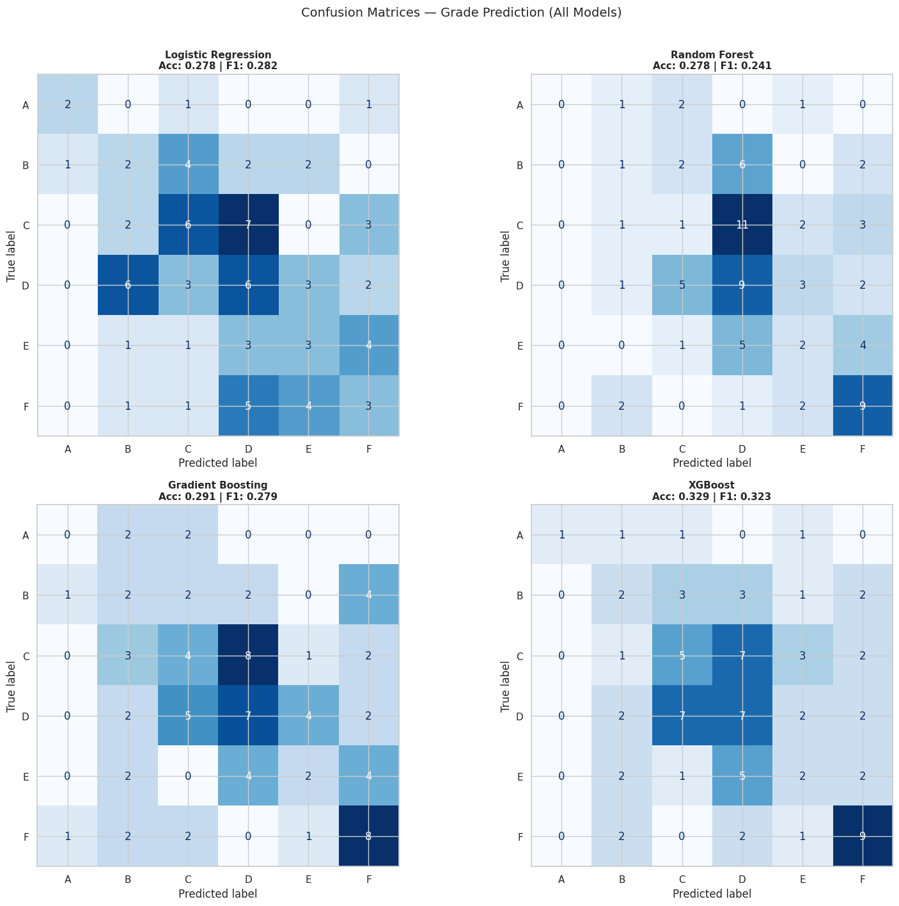
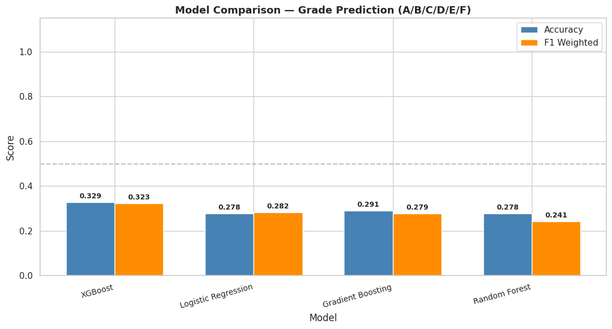
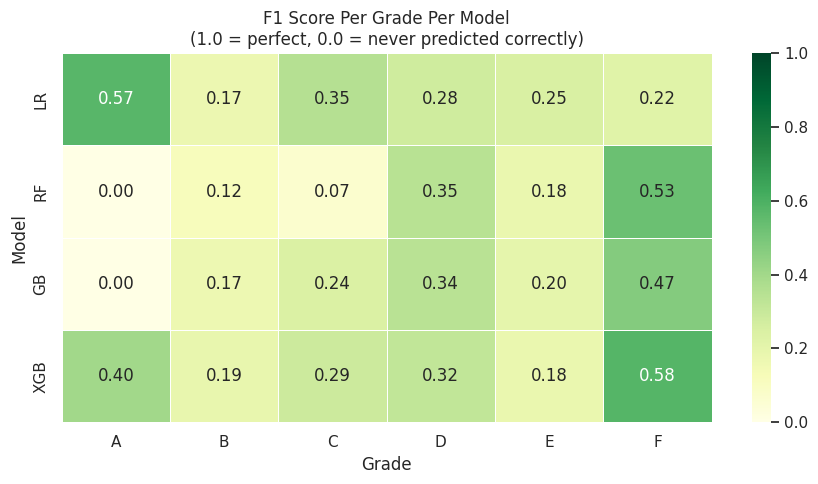
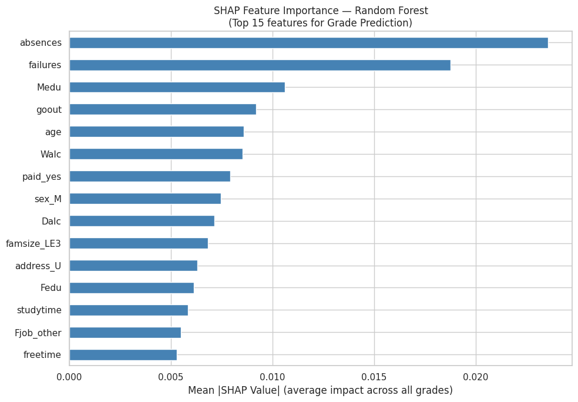

# 🎓 Student Performance Prediction

Predicting student academic outcomes using ensemble machine learning — built as a mini project for the Machine Learning course at PES University.

---

## 📌 Project Overview

> *"Can we predict how a student will perform academically based on their lifestyle, background, and family factors — before their results are out?"*

We built two versions of the prediction system:

| Version | Task | Best Model | Best F1 |
|---|---|---|---|
| **v1** | Binary — Pass / Fail | Random Forest | 0.797 |
| **v2** | Multi-class — A / B / C / D / E / F | XGBoost | 0.323 |

---

## 👥 Team

| Member | Role |
|---|---|
| Suhas J | EDA, Preprocessing |
| Shreyas Shashidhar Pai | Model Building |
| Shreyas S A | Evaluation, Visualization & web application |

---

## 📁 Repository Structure

```
student-performance-prediction/
│
├── v1-binary/
│   ├── notebooks/
│   │   ├── 01_eda_preprocessing.ipynb
│   │   ├── 02_models.ipynb
│   │   ├── 03_evaluation.ipynb
│   │   └── 04_predictor_app.ipynb
│   ├── data/processed/
│   │   ├── X_train.csv, X_test.csv
│   │   ├── y_train.csv, y_test.csv
│   │   └── results_summary.csv
│   └── figures/
│       ├── confusion_matrices.png
│       ├── roc_auc_curves.png
│       ├── model_comparison.png
│       └── shap_importance_bar.png
│
├── v2-grade-prediction/
│   ├── notebooks/
│   │   ├── v2_01_eda_preprocessing.ipynb
│   │   ├── v2_02_models.ipynb
│   │   ├── v2_03_evaluation.ipynb
│   │   └── v2_04_grade_predictor_app.ipynb
│   ├── data/processed/
│   │   ├── X_train_v2.csv, X_test_v2.csv
│   │   ├── y_train_v2.csv, y_test_v2.csv
│   │   └── results_summary_v2.csv
│   └── figures/
│       ├── confusion_matrices_v2.png
│       ├── model_comparison_v2.png
│       ├── f1_per_grade_heatmap.png
│       └── shap_importance_v2.png
│
└── README.md
```

---

## 🗃️ Dataset

**UCI Student Performance Dataset**
- 395 students, 33 features
- Features: study time, absences, parental education, alcohol use, family support, and more
- Target: Final grade G3 (0–20 scale)
- Source: [UCI ML Repository](https://archive.ics.uci.edu/dataset/320/student+performance)

---

## ⚙️ Tech Stack

- **Language:** Python
- **Libraries:** pandas, numpy, scikit-learn, xgboost, matplotlib, seaborn, shap, gradio
- **Environment:** Google Colab
- **Models:** Logistic Regression, Random Forest, Gradient Boosting, XGBoost

---

## 🔵 Version 1 — Pass / Fail Prediction

### Target Variable
```
G3 >= 10  →  Pass  (1)
G3 <  10  →  Fail  (0)
```

### Pipeline
```
Raw Data → EDA → Preprocessing → Model Training (GridSearchCV) → Evaluation + SHAP → Web App
```

### Results

| Model | Accuracy | F1 Score |
|---|---|---|
| 🏆 Random Forest | 68.4% | 0.797 |
| XGBoost | 68.4% | 0.786 |
| Logistic Regression | 63.3% | 0.739 |
| Gradient Boosting | 55.7% | 0.660 |

### Key Findings (SHAP Analysis)
1. **`failures`** — Past class failures is the strongest predictor of failing again
2. **`absences`** — High absenteeism strongly correlates with poor outcomes
3. **`goout`** — Frequency of going out with friends negatively impacts performance

### Visualizations

| Confusion Matrices | ROC-AUC Curves |
|---|---|
|  |  |

| Model Comparison | SHAP Feature Importance |
|---|---|
|  |  |

---

## 🟢 Version 2 — Letter Grade Prediction (A / B / C / D / E / F)

An extended version predicting the exact letter grade — useful for identifying where an average student lands and what they need to improve to reach the next grade.

### Grade Scale
```
18–20  →  A  (Excellent)
15–17  →  B  (Good)
12–14  →  C  (Satisfactory)
10–11  →  D  (Sufficient)
 8– 9  →  E  (Poor)
 0– 7  →  F  (Fail)
```

### Pipeline
```
Raw Data → EDA → Grade Mapping → Preprocessing → Multi-class Training → Per-Grade Evaluation + SHAP → Web App
```

### Results

| Model | Accuracy | F1 Weighted |
|---|---|---|
| 🏆 XGBoost | 32.9% | 0.323 |
| Gradient Boosting | 29.1% | 0.279 |
| Logistic Regression | 27.9% | 0.282 |
| Random Forest | 27.9% | 0.241 |

> **Note on accuracy:** Random guessing across 6 classes yields ~16.7%. Our best model at 32.9% is approximately **2× better than chance**. The modest absolute score reflects the difficulty of fine-grained grade prediction from lifestyle features alone — factors like actual exam effort and teaching quality are not captured in this dataset.

### Key Findings (SHAP Analysis)
1. **`absences`** — Becomes the #1 predictor in grade prediction, overtaking failures from v1
2. **`failures`** — Remains a strong second predictor
3. **`Medu`** — Mother's education level has meaningful impact on grade attainment

### What's New in v2
- 6-class multi-class classification with `weighted` F1 scoring
- Per-grade F1 heatmap showing which grades each model predicts best
- Live grade predictor web app with tailored improvement suggestions per grade

### Visualizations

| Confusion Matrices | Model Comparison |
|---|---|
|  |  |

| F1 Per Grade Heatmap | SHAP Feature Importance |
|---|---|
|  |  |

---

## 🌐 Web App Demo

Both versions include a live Gradio web app runnable directly in Google Colab:

| App | Notebook | Output |
|---|---|---|
| v1 Pass/Fail Predictor | `v1-binary/notebooks/04_predictor_app.ipynb` | Pass / Fail + confidence % |
| v2 Grade Predictor | `v2-grade-prediction/notebooks/v2_04_grade_predictor_app.ipynb` | Letter grade + per-grade confidence + improvement tip |

To run: open the notebook in Colab, upload the required `.pkl` files, run all cells. A public shareable link valid for 72 hours will be generated automatically.

---

## 🚀 How to Run

### Install dependencies
```bash
pip install pandas numpy scikit-learn xgboost matplotlib seaborn shap gradio jupyter
```

### Execution order (same for both v1 and v2)
```
Notebook 1  →  EDA + preprocessing  →  produces processed CSVs
     ↓
Notebook 2  →  model training        →  produces .pkl model files
     ↓
Notebook 3  →  evaluation + plots    →  produces figures
     ↓
Notebook 4  →  web app               →  upload pkl + csv from notebooks 1 & 2
```

---

## 📊 v1 vs v2 — Side by Side

| Aspect | v1 (Binary) | v2 (Multi-class) |
|---|---|---|
| Task | Pass / Fail | A / B / C / D / E / F |
| Classes | 2 | 6 |
| Best Model | Random Forest | XGBoost |
| Best Accuracy | 68.4% | 32.9% |
| Best F1 | 0.797 | 0.323 |
| Random Baseline | 50.0% | 16.7% |
| Lift over random | +18.4% | +16.2% |
| Top Feature (SHAP) | failures | absences |

---

*PES University — Machine Learning Mini Project | ECE Department | 2026*
